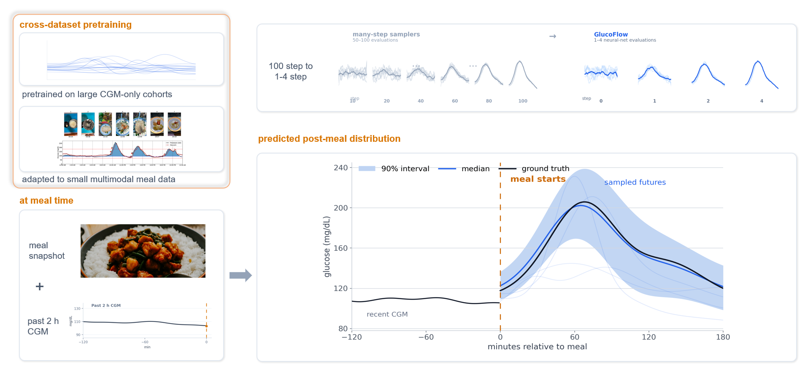

<div align="center">

# GlucoFlow

### Fast probabilistic forecasting that transfers from large source datasets to small target datasets


**Pretrain temporal dynamics once. Adapt with limited target data. Generate full predictive distributions in 1–4 steps.**



</div>

> [!IMPORTANT]
> GlucoFlow is research software, not a medical device. It must not be used for diagnosis, insulin dosing, treatment, alarms, or other clinical decisions.

## Why GlucoFlow?

Many forecasting projects have the same data problem: historical time series are plentiful, but the target cohort or target modality is small. GlucoFlow is designed for that setting.

| What you need | What GlucoFlow provides |
|---|---|
| **Reliable uncertainty, not only a point estimate** | Samples complete future trajectories and returns medians, intervals, event probabilities, or any task-specific summary. |
| **Fast probabilistic inference** | Uses a conditional rectified flow with only 1, 2, or 4 Euler steps instead of a long diffusion chain. |
| **Better use of scarce target data** | Learns reusable temporal dynamics from larger source datasets before adapting to the smaller target dataset. |
| **Optional side information** | Conditions on images, nutrients, metadata, learned embeddings, or a null token when side information is unavailable. |
| **A practical transfer path** | Includes a released temporal checkpoint, reusable model modules, reference training scripts, and a custom dataset-adapter example. |

GlucoFlow is especially useful when:

- you have one or more large source time-series datasets and a smaller target dataset;
- the target task needs calibrated ranges or sampled futures rather than a single prediction;
- side information is informative but incomplete or expensive to collect;
- iterative generative forecasting is too slow for the intended deployment path.

## Install

```bash
git clone https://github.com/OliverDOU776/Few-step-probabilistic-glucose-forecasting-from-continuous-glucose-monitoring-and-meal-images.git
cd Few-step-probabilistic-glucose-forecasting-from-continuous-glucose-monitoring-and-meal-images

python3.11 -m venv .venv
source .venv/bin/activate          # Windows PowerShell: .venv\Scripts\Activate.ps1
python -m pip install --upgrade pip
python -m pip install -e ".[vision]"
```

For development:

```bash
python -m pip install -e ".[vision,dev]"
pytest -q
```

## Quick start: sample future trajectories

The repository includes a Stage-A temporal checkpoint at `checkpoints/stage_a.pt`. Inputs must be normalized using statistics fitted on the training split of your target application.

```python
from pathlib import Path

import torch

from glucoflow.models import build_flow_model

model = build_flow_model(history_len=24, prediction_len=24)
state = torch.load(
    Path("checkpoints/stage_a.pt"),
    map_location="cpu",
    weights_only=True,
)
model.load_state_dict(state, strict=True)
model.eval()

# Example: two normalized histories with 24 time points each.
history = torch.randn(2, 24)
time_features = torch.zeros(2, 24, 4)

with torch.no_grad():
    samples = model.sample(
        history,
        nfe=4,
        num_samples=100,
        time_features=time_features,
        meal_embed=None,
    )

# samples: [batch, sampled futures, forecast length]
median = samples.median(dim=1).values
lower = samples.quantile(0.05, dim=1)
upper = samples.quantile(0.95, dim=1)

print(samples.shape)  # torch.Size([2, 100, 24])
```

Run the data-free checkpoint verification:

```bash
python scripts/smoke_test.py
```

## Add optional conditioning

The flow model accepts an optional conditioning tensor through `meal_embed`. In the associated glucose study, that tensor represents meal photographs and nutrients, but it can represent any target-domain context with the configured embedding dimension.

```python
conditioning = torch.randn(2, 512)

with torch.no_grad():
    conditioned_samples = model.sample(
        history,
        nfe=2,
        num_samples=100,
        time_features=time_features,
        meal_embed=conditioning,
    )
```

The supplied `MealEncoder` demonstrates one image–nutrient implementation. A new application can replace it with an encoder for text, categorical metadata, sensor context, interventions, or another modality.

## Bring your own dataset

### 1. Implement the shared adapter contract

`glucoflow.data.adapters.base.DatasetOutput` defines the data interface. For the supplied glucose-oriented schema, the minimum time-series table is:

```text
subject_id | timestamp | glucose_mgdl
```

A ready-to-run CSV template is provided in [`examples/custom_adapter.py`](examples/custom_adapter.py).

```bash
python examples/custom_adapter.py /path/to/my_dataset
```

The example expects:

```text
my_dataset/
├── cgm.csv          # required
├── meals.csv        # optional conditioning events
└── subjects.csv     # optional subject metadata
```

For a non-glucose application, map the target signal into the supplied schema for a quick prototype, or fork the schema with domain-appropriate names.

### 2. Set the forecasting task

Choose the history length, forecast length, sampling interval, normalization strategy, and evaluation metrics for the target application. Do not inherit the glucose-study defaults without checking whether they fit the new problem.

### 3. Pretrain or start from the released checkpoint

Use `scripts/pretrain.py` as a reference for multi-dataset temporal pretraining. The released checkpoint is a useful initialization when the target signal is sufficiently related to the original physiological time series; otherwise, pretrain the same architecture on your own source datasets.

### 4. Adapt to the target dataset

Use `scripts/finetune_cgmacros.py` as a reference for target-domain adaptation with optional conditioning and modality dropout. The reusable modules in `src/glucoflow/` can also be called directly from a cleaner application-specific trainer.

### 5. Keep model selection honest

Fit normalization, choose checkpoints, tune uncertainty scales, and select operating parameters using training and validation data only. Evaluate the held-out test split after the configuration is fixed.

## Main entry points

| Path | Purpose |
|---|---|
| `src/glucoflow/models/` | Rectified-flow backbone, Euler sampling, and conditioning modules. |
| `src/glucoflow/data/` | Shared schema, adapters, normalization, and dataset utilities. |
| `src/glucoflow/evaluation/` | Reusable splits, windows, and probabilistic metrics. |
| `scripts/pretrain.py` | Reference multi-dataset temporal pretraining. |
| `scripts/finetune_cgmacros.py` | Reference target adaptation with optional multimodal conditioning. |
| `scripts/prepare_data.py` | Reference preprocessing and feature caching. |
| `examples/custom_adapter.py` | Minimal template for connecting a new dataset. |
| `scripts/smoke_test.py` | Data-free checkpoint and NFE=1/2/4 inference test. |
| `scripts/validate_release.py` | Source-tree and release-integrity checks. |

## Repository layout

```text
.
├── src/glucoflow/
│   ├── models/              # Conditional rectified flow and conditioning
│   ├── data/                # Shared schema, normalization, adapters
│   └── evaluation/          # Splits, windows, probabilistic metrics
├── scripts/                 # Preparation, pretraining, adaptation, validation
├── examples/                # Bring-your-own-data templates
├── checkpoints/stage_a.pt   # Released temporal initialization
├── tests/                   # Data-free unit and integrity tests
└── assets/overview.png      # Architecture overview
```

## Associated research

**Paper:** arXiv preprint coming soon.

The associated study applies GlucoFlow to multimodal glucose forecasting using CGMacros, cross-dataset CGM pretraining, five GlucoBench evaluation cohorts, OhioT1DM, and the official controlled-access DiaTrend cohort. The software architecture is designed to be reused beyond that study by replacing the data adapter, target-specific conditioning, and evaluation layer.

## Checkpoint and responsible use

`checkpoints/stage_a.pt` is a CGM-only temporal initialization, not a calibrated model for a new population or application.

```text
SHA-256  759dabb7a5b20f9377a8d9ddaa2ae333d8e7166bc07c8d17a04f14d58acdd5a7
```

Before using it on a new dataset:

- fit target-specific normalization;
- evaluate distribution shift and missingness;
- adapt and calibrate using target-domain data;
- test uncertainty quality, not only point error;
- conduct application-specific safety and privacy review.

See [MODEL_CARD.md](MODEL_CARD.md) for intended use, limitations, and out-of-scope applications.

## Citation

```bibtex
@misc{wang2026glucoflow,
  title  = {GlucoFlow: Cross-Dataset Pretraining for Few-Step
            Probabilistic Glucose Forecasting},
  author = {Wang, Zijia and Toumazou, Christofer},
  year   = {2026},
  note   = {Research software; arXiv preprint forthcoming},
  url    = {https://github.com/OliverDOU776/Few-step-probabilistic-glucose-forecasting-from-continuous-glucose-monitoring-and-meal-images}
}
```

## Third-party components and data terms

The optional image path uses OpenCLIP and public LAION ViT-B/32 weights. Dataset licenses and controlled-access agreements do not transfer to this repository. See [THIRD_PARTY.md](THIRD_PARTY.md) before redistributing derived models, embeddings, or data artifacts.
