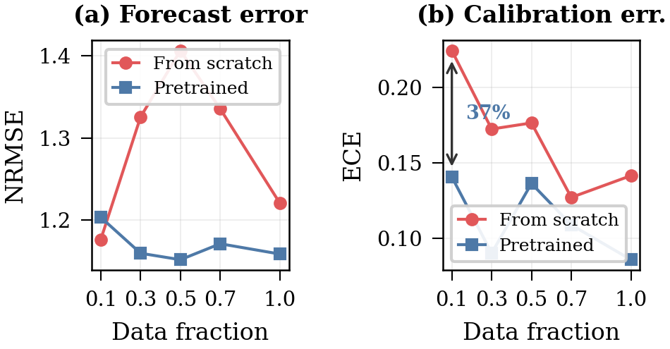
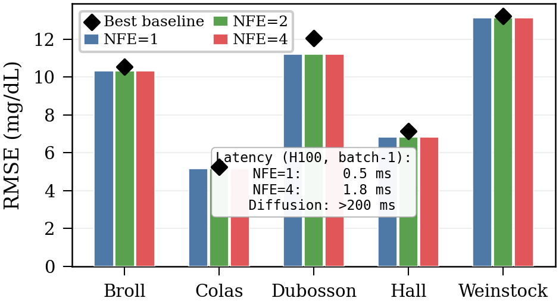

<div align="center">

# GlucoFlow

### Few-step multimodal probabilistic glucose forecasting

[](https://github.com/OliverDOU776/paper-Few-Step)


Conditional rectified flow + cross-dataset CGM pretraining + visual-nutritional meal alignment.


</div>

> [!IMPORTANT]
> GlucoFlow is research software, not a medical device. It must not be used for diagnosis, insulin dosing, treatment, or any other clinical decision.

## What is GlucoFlow?

GlucoFlow forecasts a distribution of future glucose trajectories from recent continuous glucose monitoring (CGM) history and optional meal information. It is designed around three ideas:

| Component | Purpose |
|---|---|
| **Few-step rectified flow** | Generates probabilistic trajectories with 1, 2, or 4 Euler steps instead of a long diffusion chain. |
| **Cross-dataset pretraining** | Learns glucose dynamics from larger CGM-only cohorts before adapting to scarce multimodal data. |
| **Unified meal representation** | Aligns frozen OpenCLIP meal-photo features with nutrients and supports photo, nutrient-only, or missing-meal inputs. |

The central finding is a data-scarcity effect: on the manuscript's subject-disjoint CGMacros experiment, adding photos after pretraining improves 120-minute MAE from **28.08 to 25.72 mg/dL**, while adding photos from scratch worsens it from **30.98 to 31.77 mg/dL**.

<p align="center">
  
</p>

The paper reports NFE=1 latency of **0.5 ms** and NFE=4 latency of **1.8 ms** on an NVIDIA H100 at batch size 1 with precomputed image embeddings. These numbers exclude image encoding, data loading, and preprocessing and should not be interpreted as end-to-end device latency.

<p align="center">
  
</p>

## Repository layout

```text
.
├── src/glucoflow/          # Models, dataset adapters, windows, splits, metrics
├── scripts/                # Data preparation, training, and evaluation entry points
├── checkpoints/stage_a.pt  # Audited CGM-only initialization checkpoint
├── results/                # Compact reported-result snapshot and provenance notes
├── assets/                 # README figures from the manuscript repository
├── docs/                   # Dataset access and reproduction instructions
└── tests/                  # Data-free unit and release-integrity tests
```

Raw data, meal photographs, CLIP embeddings, run logs, sweep archives, and per-subject outputs are deliberately excluded.

## Installation

```bash
git clone https://github.com/OliverDOU776/Few-step-probabilistic-glucose-forecasting-from-continuous-glucose-monitoring-and-meal-images.git
cd Few-step-probabilistic-glucose-forecasting-from-continuous-glucose-monitoring-and-meal-images

python3.11 -m venv .venv
source .venv/bin/activate
python -m pip install --upgrade pip
python -m pip install -e ".[vision]"
```

Run a data-free checkpoint smoke test:

```bash
python scripts/smoke_test.py
```

For development:

```bash
python -m pip install -e ".[vision,dev]"
pytest -q
python scripts/validate_release.py
```

## Data preparation

No health data are distributed in this repository. Obtain each dataset from its owner and accept its terms before placing it under `data/raw/`. The exact sources, licenses, access controls, and expected directory layout are documented in [docs/DATA.md](docs/DATA.md).

For the multimodal path, prepare CGMacros and the GlucoBench checkout, then build data cards and frozen OpenCLIP embeddings:

```bash
python scripts/prepare_data.py
```

The photo-conditioned runners stop with an error when the CLIP cache is absent; they do not silently report a nutrient-only run as multimodal.

## Training and evaluation

```bash
# Stage A: CGM-only pretraining
python scripts/pretrain.py --seed 42 --split-seed 42

# Stage B: subject-disjoint multimodal CGMacros fine-tuning
python scripts/finetune_cgmacros.py --mode run --seed 42 --split-seed 42

# CGMacros P1 direct-task evaluation (single seeded run)
python scripts/evaluate_cgmacros.py \
  --mode run --config-name p1_anchor_photo --use-photo \
  --seed 42 --epochs 20 --patience 5

# One fixed GlucoBench run; aggregate mode selects across runs on validation metrics
python scripts/evaluate_glucobench.py \
  --mode run --dataset weinstock --config-name release_weinstock \
  --seed 42 --split-seed 10 --use-anchor --warm-start \
  --in-len-source linreg

# OhioT1DM clinical-event evaluation
python scripts/evaluate_clinical.py \
  --mode run --dataset ohio_t1dm --config-name release_ohio --seed 42
```

See [docs/REPRODUCING.md](docs/REPRODUCING.md) for complete commands, output locations, and the distinction between a single-run reproduction and the archived manuscript snapshot.

## Checkpoint

`checkpoints/stage_a.pt` contains a PyTorch state dictionary for the Stage-A CGM-only backbone.

```text
SHA-256  759dabb7a5b20f9377a8d9ddaa2ae333d8e7166bc07c8d17a04f14d58acdd5a7
```

Its intended use and limitations are in [MODEL_CARD.md](MODEL_CARD.md).

## Reproducibility status

- Core model, sampling, split, metric, and release-integrity tests are data-free.
- The committed tables in `results/` are a compact manuscript-era snapshot, not raw experiment logs.
- The original workspace did not retain a complete fixed three-seed manifest for every reported cell. Public commands are therefore labeled as single-run reproductions; they do not claim one-command regeneration of manuscript mean +/- standard deviation values.
- The public GlucoBench aggregator has been hardened to choose configurations using validation metrics before reporting held-out test metrics.
- A release audit found that a local 1,720-person **DiaData** integration had previously been mislabeled as the 54-person controlled-access **DiaTrend** dataset. The unsupported row and adapter are intentionally withheld here pending a provenance-correct rerun. See [docs/DATA.md](docs/DATA.md#diatrend-and-diadata-are-not-interchangeable).

## Citation

The manuscript is under review and its author list is currently anonymized. Until the citation is finalized, use:

```bibtex
@misc{glucoflow2026,
  title  = {Few-Step Multimodal Glucose Forecasting via Cross-Dataset
            Pretraining and Visual-Nutritional Meal Alignment},
  author = {Anonymous Authors},
  year   = {2026},
  note   = {Manuscript under review},
  url    = {https://github.com/OliverDOU776/paper-Few-Step}
}
```

## Acknowledgements and terms

This project builds on CGMacros, GlucoBench, OhioT1DM, BIG IDEAs Lab, HUPA-UCM, PyTorch, and OpenCLIP. Dataset and model licenses do not transfer to this repository; consult [THIRD_PARTY.md](THIRD_PARTY.md) before reuse. The project code license will be added after the authors' release decision.
